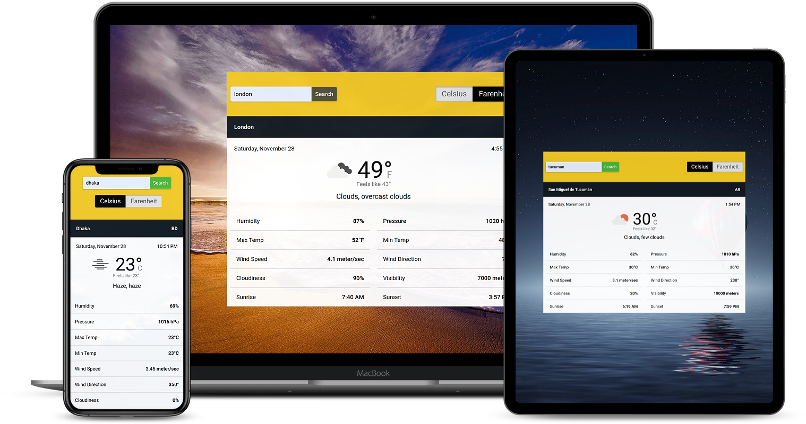

# weather-now
A simple weather app that fetches weather data using open weather API,
 according to user input, and displays it to the user. Built with Javascript.

## Screenshot

## Features 

1. Change the temperature scale between Celsius and Fahrenheit.

1. Various weather parameters such as humidity, pressure, max temp, min temp, wind speed, wind direction, cloudiness, 
visibility, etc. are displayed.

1. Current data and time of the queried city are also displayed.

1. The sunrise and sunset time is also generated according to the queried city's timezone.

1. The background image changes according to the weather condition.

1. Built with fully responsive design. Works on the device of your choice.

## Built With

- HTML/CSS
- Javascript
- Webpack

## Live Demo

- [Weather Now](https://rawcdn.githack.com/ershadul1/weather-now/6edea1253685d76a311e44a5cd68afb817ee44ed/dist/index.html)

## How to run this project on your local machine

### Prerequisites
1. An internet browser
1. npm

   
### Steps to follow
1. Clone the repository to your local machine using `git clone https://github.com/ershadul1/weather-now.git`
1. On your local machine, navigate to the folder using `cd weather-now` in your terminal.
1. Run `npm install` for installing all the dependencies.
1. Navigate to the dist folder.
1. Open the `index.html` with your preferred browser.

## Contributions

  There are two ways of contributing to this project:

1.  If you see something wrong or not working, please check [the issue tracker section](https://github.com/ershadul1/weather-now/issues), if that problem you met is not in already opened issues then open the issue by clicking on the `new issue` button.

2.  If you have a solution to that, and you are willing to work on it, follow the below steps to contribute:
    1.  Fork this repository
    1.  Clone it on your local computer by running `git clone https://github.com/ershadul1/weather-now.git` __Replace *ershadul1* with the username you use on github__
    1.  Open the cloned repository which appears as a folder on your local computer with your favorite code editor
    1.  Create a separate branch of the *master branch*,
    1.  Write your codes which fix the issue you found
    1.  Commit and push the branch you created
    1.  Raise a pull request, comparing your new created branch with our original master branch [here](https://github.com/ershadul1/weather-now)

## Author 

👤 **Ershadul Rayhan**

- Github: [@ershadul1](https://github.com/ershadul1)
- Twitter: [@ErshadulRayhan](https://twitter.com/ErshadulRayhan)
- Linkedin: [ErshadulRayhan](https://www.linkedin.com/in/ershadulrayhan/)
- Email:  ershadul.rayhan@gmail.com

## Show your support

Give a ⭐️ if you like this project!

## Acknowledgments
- This project was inspired by the [Microverse](https:www.microverse.org) program
- Open Weather API